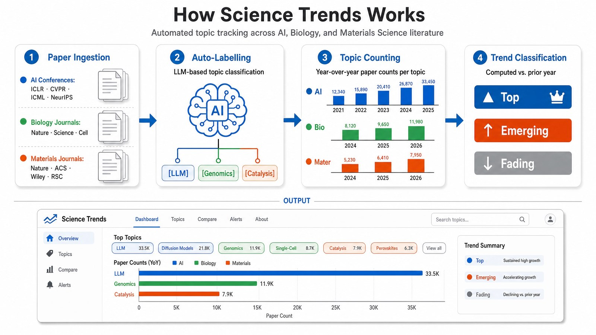

We all *feel* the firehose: thousands of papers a month, every field moving at
once, and no honest way to tell a genuine wave from your own reading bias. So I
built a small family of tools that answer one question with data instead of vibes:

> **Which research topics are rising, which are fading, and what are the papers behind the trend?**

<!--more-->

Three sibling projects, one shared engine, three fields:

| Project | Tracks | Source | Live site | Code |
|---|---|---|---|---|
| 🤖 **AI-Trends** | Major AI conferences | Accepted-paper dumps (CVPR · ICCV · ICML · ICLR · NeurIPS, 2021–2025) | [charlesxu90.github.io/AI-trends](https://charlesxu90.github.io/AI-trends/) | [github.com/charlesxu90/AI-trends](https://github.com/charlesxu90/AI-trends) |
| 🧬 **Bio-Trends** | Flagship biology journals | RSS feeds (Nature · Science · Cell Press + sister titles) | [charlesxu90.github.io/Bio-trends](https://charlesxu90.github.io/Bio-trends/) | [github.com/charlesxu90/Bio-trends](https://github.com/charlesxu90/Bio-trends) |
| 🔬 **Mater-Trends** | Flagship materials-science journals | RSS feeds (Nature · Science · Cell Press · Wiley · ACS · RSC · Elsevier) | [charlesxu90.github.io/Mater-trends](https://charlesxu90.github.io/Mater-trends/) | [github.com/charlesxu90/Mater-trends](https://github.com/charlesxu90/Mater-trends) |

All three are **free, open-source (MIT), and live right now** — static sites, no
login, no tracking.



---

## What each one focuses on

**🤖 AI-Trends — what the field is presenting.**
Conferences are where AI commits to the record, so this one ingests *every accepted
paper* from the big five venues and labels it by research topic. You get top /
emerging / fading topics **year over year**, plus a **Rising Stars** view that sorts
papers by Semantic Scholar citations (title-verified to avoid wrong matches) and
links each to arXiv / Google Scholar / the source PDF.

**🧬 Bio-Trends — what biology is publishing right now.**
Journals move continuously, so this one polls **RSS feeds** from the flagship biology
families and accumulates them into a deduplicated monthly store. Trends are viewable
at **Year / Quarter / Month** granularity, and a 33-topic taxonomy *derived from the
literature itself* (scispaCy NER over a ~59k-title corpus) keeps the labels honest.

**🔬 Mater-Trends — what materials science is publishing right now.**
Same RSS engine as Bio-Trends, pointed at the broadest journal set of the three —
seven publisher families across batteries, photovoltaics, 2D materials, catalysis,
quantum materials, and more. Hand-seeded 33-topic taxonomy that expands from the
corpus over time.

The two journal trackers (Bio + Mater) add a nice touch: **rising-citation
tracking**. Each paper is snapshotted when first seen, then re-checked monthly for
three months — so the *gain* in citations becomes an early "this one's taking off"
signal, not just a static count.

---

## How they're built (the part I'm actually proud of)

Every project runs the **same deterministic pipeline**. Swap the source and the
topic list, and the same engine works for a new field:

```
sources ──▶ ingest ──▶ assign topics ──▶ compute trends ──▶ static site
(RSS feeds /  (accumulate +   (substring match    (top/emerging/    (GitHub Pages,
 conference   dedup by DOI     vs a curated        fading per         lazy-loaded
 paper dumps) → monthly CSV)   taxonomy)           group & period)    paper shards)
```

The design principles, in plain terms:

1. **Config is the source of truth.** Adding a journal, feed, or topic is a *config
   edit*, not a code change. The journal registry and taxonomy are just JSON.

2. **Everything reproducible except one human step.** Ingest, topic assignment,
   trend math, and site export are pure, deterministic Python — run them twice, get
   the same answer. The *only* non-deterministic step is **topic curation** (deciding
   which keyword belongs to which topic), and even that is assisted: spaCy/scispaCy
   NER surfaces candidate keywords from the real corpus, and a Claude Code skill
   (`/curate-topics`) decides each one — keep / new topic / noise — so the taxonomy
   grows *from the literature* and stays comparable across years.

3. **Data identity comes from file location.** A paper's journal is its folder; its
   month is the filename. Dedup falls back DOI → link → title. Idempotent: re-running
   with nothing new just re-derives the same outputs.

4. **The site is static and fast.** The pipeline exports JSON shards (one per
   journal-year) and the page lazy-loads only the years you actually open, so a
   multi-year corpus stays browsable without a heavy initial load. It deploys
   straight from `/docs` on GitHub Pages — no server to run, nothing to pay for.

5. **It keeps itself current.** A monthly GitHub Actions cron polls the sources,
   re-runs the pipeline, and opens a PR; merging republishes the site. Journals even
   declare a publish *cadence* so feeds are polled no more often than they actually
   update.

---

## Why I think this is useful

- **For researchers & students** — see where a field is heading before it's obvious,
  and jump straight to the papers behind any trend.
- **For anyone explaining a field** — defensible, sourced "here's what's hot"
  charts instead of anecdotes.
- **For builders** — the engine is field-agnostic. Point it at a new set of RSS
  feeds + a topic list and you have a trend tracker for *your* domain in an afternoon.

Three fields are live today. The architecture is built to add a fourth.

**Take a look — they're all free and open:**

- 🤖 AI → https://charlesxu90.github.io/AI-trends/
- 🧬 Bio → https://charlesxu90.github.io/Bio-trends/
- 🔬 Materials → https://charlesxu90.github.io/Mater-trends/

Stars, issues, and "please track *my* field next" requests all welcome. 🌟
